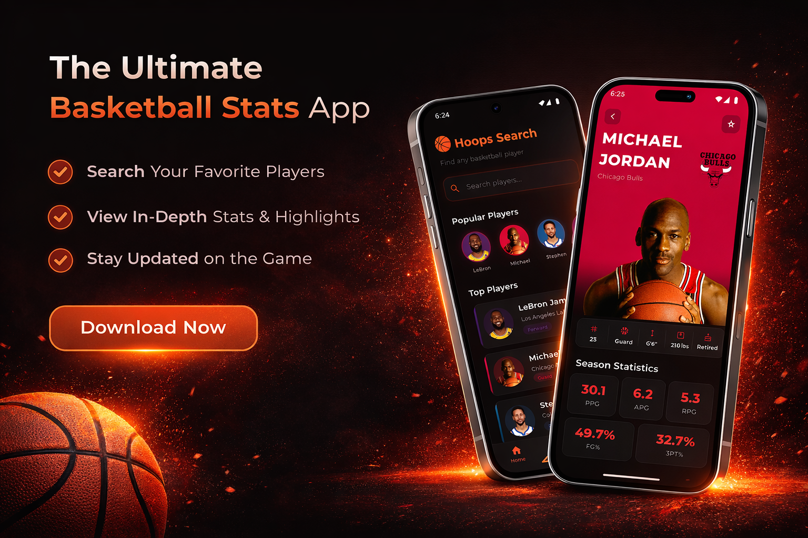
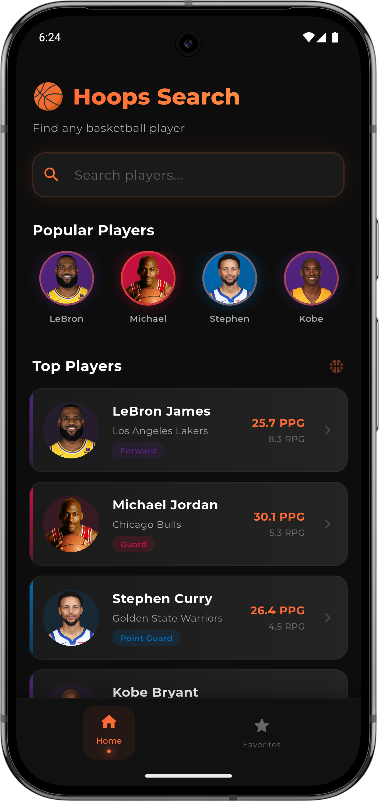
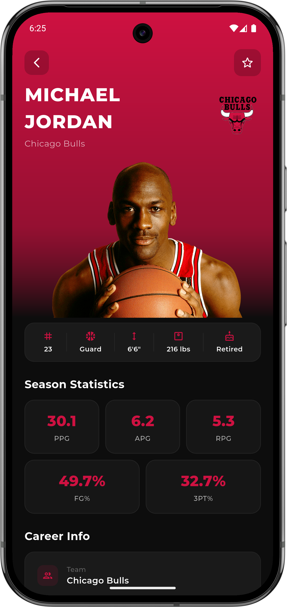
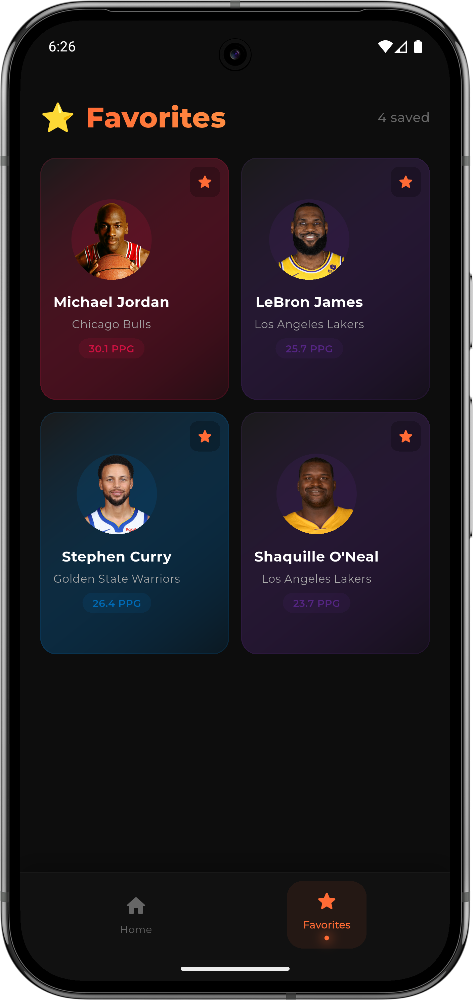

# 🏀 Basketball Live Stats App

<!-- BANNER IMAGE -->
<p align="center">
  
</p>

---

## 🚀 Live Demo
**Experience the interactive web demo here:** [Basketball Live Demo](https://basketball-livid.vercel.app/)

*Note: The live demo runs within an interactive iPhone 16 Pro Max device wrapper for a seamless native mobile experience directly in your browser!*

---

## 📖 Overview
A sleek, modern cross-platform application that provides real-time NBA player statistics, career highlights, and profiles. Built with a stunning Flutter frontend and a robust Python FastAPI backend, this app delivers a premium user experience with dynamic data fetching and clean UI design.

## ✨ Features
- **Live Player Search:** Instantly search for any NBA player with an optimized debounced search bar.
- **Detailed Player Profiles:** View high-resolution player headshots, team logos, and detailed career stats (PPG, RPG, APG, etc.).
- **Favorites System:** Save your favorite players locally using Hive database for quick offline access.
- **Dynamic Theming:** Premium dark mode UI with glassmorphism effects and dynamic team-color based backgrounds.
- **Fully Responsive:** Adapts beautifully across Mobile, Tablet, and Desktop screens.

---

## 📸 Screenshots

| Home Screen | Search Results | Player Profile |
| :---: | :---: | :---: |
|  |  |  |

---

## 🛠️ Tech Stack
### **Frontend**
- **Framework:** Flutter (Android, iOS, Web)
- **Local Storage:** Hive (NoSQL Database)
- **Fonts & Icons:** Google Fonts (Montserrat), Eva Icons
- **UI Design:** Custom Dark Theme, Glassmorphism UI, Responsive Layouts

### **Backend**
- **Framework:** Python FastAPI
- **Data Source:** `nba_api` (Official NBA.com stats)
- **Deployment:** Render (Backend API), Vercel (Frontend Demo)

---

## 🚀 Getting Started

### Prerequisites
- [Flutter SDK](https://flutter.dev/docs/get-started/install) (latest stable version)
- [Python 3.9+](https://www.python.org/downloads/)

### Installation & Setup

1. **Clone the repository:**
   ```bash
   git clone https://github.com/yadavcodes0/basketball.git
   cd basketball
   ```

2. **Install Flutter dependencies:**
   ```bash
   flutter pub get
   ```

3. **Run the Backend (Locally):**
   ```bash
   pip install -r api/requirements.txt
   uvicorn api.search:app --host 0.0.0.0 --port 8000
   ```

4. **Run the Flutter App:**
   ```bash
   flutter run
   ```

---

## 🤝 Contributing
Contributions, issues, and feature requests are welcome! Feel free to check the issues page.

## 📜 License
This project is licensed under the [MIT License](LICENSE).